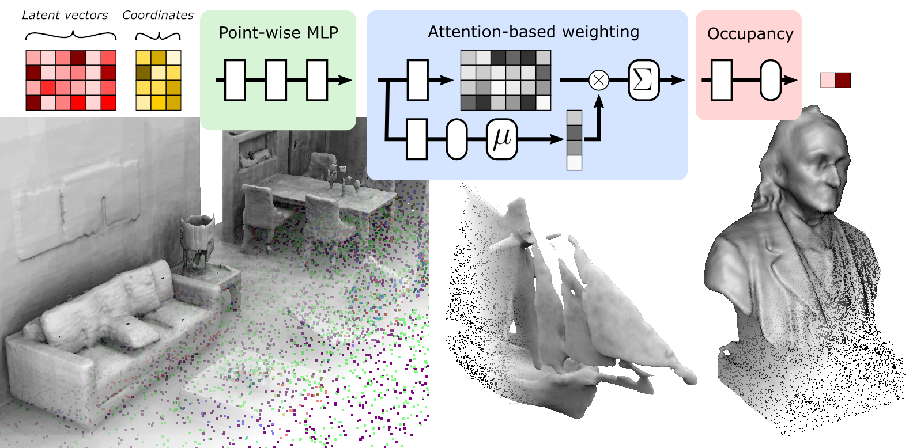

# POCO: Point Convolution for Surface Reconstruction

by: [Alexandre Boulch](https://www.boulch.eu) and [Renaud Marlet](http://imagine.enpc.fr/~marletr/)

Computer Vision and Pattern Recognition, CVPR, 2022

[Paper](https://openaccess.thecvf.com/content/CVPR2022/html/Boulch_POCO_Point_Convolution_for_Surface_Reconstruction_CVPR_2022_paper.html)&nbsp;&nbsp;&nbsp;
[PDF](https://openaccess.thecvf.com/content/CVPR2022/papers/Boulch_POCO_Point_Convolution_for_Surface_Reconstruction_CVPR_2022_paper.pdf)&nbsp;&nbsp;&nbsp;
[Supp](https://openaccess.thecvf.com/content/CVPR2022/supplemental/Boulch_POCO_Point_Convolution_CVPR_2022_supplemental.pdf)&nbsp;&nbsp;&nbsp;
[Arxiv](http://arxiv.org/abs/2201.01831)





---
## Abstract
> Implicit neural networks have been successfully used for surface reconstruction from point clouds. However, many of them face scalability issues as they encode the isosurface function of a whole object or scene into a single latent vector. To overcome this limitation, a few approaches infer latent vectors on a coarse regular 3D grid or on 3D patches, and interpolate them to answer occupancy queries. In doing so, they loose the direct connection with the input points sampled on the surface of objects, and they attach information uniformly in space rather than where it matters the most, i.e., near the surface. Besides, relying on fixed patch sizes may require discretization tuning. To address these issues, we propose to use point cloud convolutions and compute latent vectors at each input point. We then perform a learning-based interpolation on nearest neighbors using inferred weights. Experiments on both object and scene datasets show that our approach significantly outperforms other methods on most classical metrics, producing finer details and better reconstructing thinner volumes.

---
## Citation

```
@InProceedings{Boulch_2022_CVPR,
    author    = {Boulch, Alexandre and Marlet, Renaud},
    title     = {POCO: Point Convolution for Surface Reconstruction},
    booktitle = {Proceedings of the IEEE/CVF Conference on Computer Vision and Pattern Recognition (CVPR)},
    month     = {June},
    year      = {2022},
    pages     = {6302-6314}
}
```

---
## Installation

The code was used with Ubuntu, Python 3.7.10, Cuda 11.1 and Pytorch 1.8.1

Run the following command.   
**Note** - The following script will require a reboot. Make sure to complete the remaining commands after rebooting.
```
bash install.sh
```

### Building the triangle hash module (from ConvONet)

This module is used for score computation

```
CC=gcc CXX=gcc python setup_c.py build_ext --inplace
python setup.py build_ext --inplace
```
---
## Data

### ShapeNet ([Occupancy Network](https://github.com/autonomousvision/convolutional_occupancy_networks) pre-processing)

Run the following script to setup the data required for training.

```
bash datasetup.sh
```

---
## Training

```bash
# train on ShapeNet with 3k points, noise and without normals 
python train.py --config configs/config_shapenet.yaml 

# train on ShapeNet with 10k points, no noise and normals
python train.py --config configs/config_shapenet.yaml --normals True --random_noise 0 --experiment_name Normals

```

---
## Generation

### ShapeNet (FOCUS ON THIS !!)

```bash
python generate_inference.py --config results/ShapeNet_None_FKAConv_InterpAttentionKHeadsNet_None/config.yaml --gen_resolution_global 128
```
## Evaluation

### ShapeNet

```bash
python eval_meshes.py --gendir results/ShapeNet_None_FKAConv_InterpAttentionKHeadsNet_None/gen_ShapeNet_test_3000/ --meshdir meshes --dataset ShapeNet --split test --gtdir data/ShapeNet
```

## Pretrained models

We provide pre-trained models for FKAConv backbone.

[ShapeNet 3k, noise, no normals](https://github.com/valeoai/POCO/releases/download/v0.0.0/ShapeNet_3k.zip)

[ShapeNet 3k, no noise, normals](https://github.com/valeoai/POCO/releases/download/v0.0.0/ShapeNet_3k_normals.zip)


