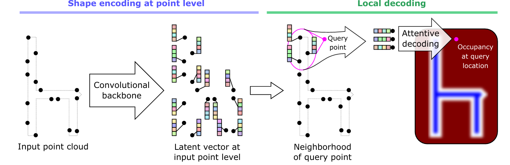

# Accelerating POCO Inference in 3D Reconstruction of Point Clouds

by: 

- Christine Muthee - cmuthee
- Tewodros Kederalah Idris - tidris
- Daniel Gbenga Owolabi - dowolabi
- Emmanuel Amankwaa Adjei - eaadjei




---
## Abstract
> Efficient 3D reconstruction is crucial for autonomous driving, AR/VR, and medical imaging. Current methods like POCO improve memory efficiency and detail but struggle with diverse point cloud complexities, leading to inefficiencies and lower fidelity. 

> This study integrates Graph Attention Networks (GATs) into POCO to prioritize features based on geometric relevance. Our approach includes GAT layers, input transformations, skip connections, and an enhanced decoder for scalable 3D reconstructions. Tests on ShapeNet show reduced inference time from 2.8129 to 2.7331 seconds, indicating improved efficiency. While the model maintained competitive fidelity as measured by Chamfer distance and IoU, it slightly lagged behind the baseline.

> These results underscore the efficiency-accuracy trade-off in attention-based 3D reconstruction. By addressing memory overhead and hyperparameter sensitivity, our framework supports scalable real-time applications. Future work will investigate hybrid architectures and optimizations for better computational performance and reconstruction quality.

---
## Installation

The code was used with Ubuntu, Python 3.7.10, Cuda 11.1 and Pytorch 1.8.1

Run the following command.   
**Note** - The following script will require a reboot. Make sure to complete the remaining commands after rebooting.
```
bash install.sh
```

## Data

### ShapeNet ([Occupancy Network](https://github.com/autonomousvision/convolutional_occupancy_networks) pre-processing)

Run the following script to setup the data required for training.

```
bash datasetup.sh
```

---
## Training

### NOTE
The new backbone built using GAT has been placed in the networks/network.py script and used to replace the self.net in the model.

```bash
# train on ShapeNet with 3k points, noise and without normals 
python train.py --config configs/config_shapenet.yaml 
```

---
## Generation

### ShapeNet

```bash
python generate.py --config results/ShapeNet_None_FKAConv_InterpAttentionKHeadsNet_None/config.yaml --gen_resolution_global 128
```